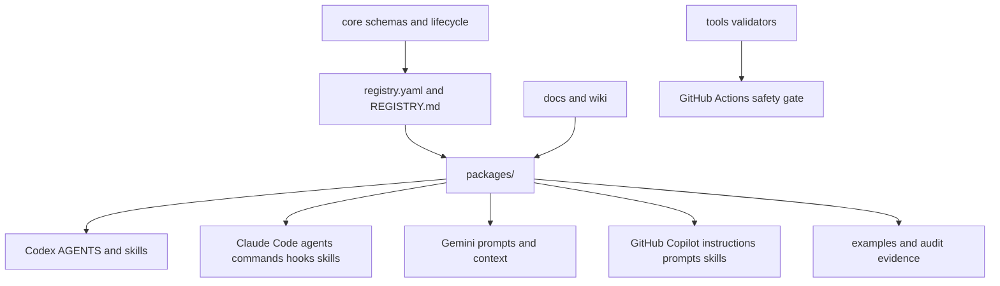

# Architecture

## Purpose

AI Workflow Kits is a workflow-first repository. A workflow package defines shared intent once, then projects that intent into the native surface of each AI runtime.

## Repository map

| Area | Owns | Depends on |
| --- | --- | --- |
| `core/` | Shared schemas and lifecycle contracts | package examples and validators |
| `packages/` | Workflow packages and runtime projections | `core/`, `templates/`, `registry.yaml` |
| `runtimes/` | Runtime adapter notes | package runtime directories |
| `docs/` | Public guides, wiki source, publication rules | package READMEs and examples |
| `tools/` | Validation gates | Git-tracked repo content |
| `.github/workflows/` | CI entrypoints | `tools/` validators |

## Runtime projection flow

1. Author package intent in `packages/<package-id>/README.md` and `manifest.yaml`.
2. Add runtime-native artifacts under the package, for example `codex/`, `claude/`, `gemini/`, or `copilot/`.
3. Register the package in `registry.yaml` and `REGISTRY.md`.
4. Add examples or audit evidence that show how the package is used.
5. Run `python tools/public-safety-scan.py` and `python tools/validate-context-paths.py`.

## Cross-module dependencies

- `registry.yaml` is the machine-readable catalog and should match `REGISTRY.md`.
- Package manifests should point to package-local docs and runtime surfaces.
- Wiki pages in `docs/wiki/` should mirror published package concepts without becoming the source of truth.
- Validators in `tools/` should stay independent from runtime-specific private state.

## Verification gates

- Public safety: `tools/public-safety-scan.py` blocks private paths, tokens, and tracked binary artifacts.
- Context integrity: `tools/validate-context-paths.py` checks Markdown links and repo-relative path references.
- Agent readiness: `CLAUDE.md`, package READMEs, and module context files act as compact navigation surfaces.

## Non-obvious rules

Important: do not flatten runtime artifacts into top-level `skills/`, `agents/`, or `prompts` directories. Keep package-first organization so one workflow can be projected to multiple runtimes.

Note: examples may use placeholders such as `packages/<package-id>/...`; those are templates, not missing production files.
