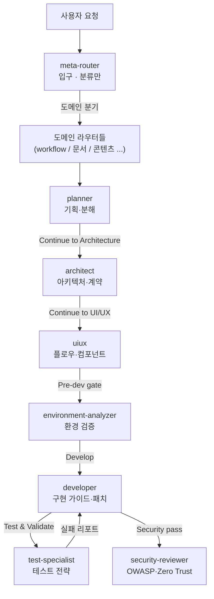
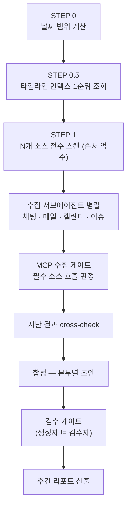

# Agent & Skill — 해부 (Anatomy / Deep-Dive)

> **개념편** [`agent-vs-skill`](../agent-vs-skill/README.md) 이 "에이전트 vs 스킬"을 추상적으로 비교했다면,
> 이 **심화편**은 실제 표본을 **뜯어서** 구조·사용법·사용예를 보여준다.
> 표본 1: 실제 **GitHub Copilot 커스텀 에이전트** 한 세트(멀티에이전트 SDLC 파이프라인). 표본 2: 실제 **Claude 스킬** 2종.
>
> ⚠️ 모든 표본은 **익명화**되어 있다 — 사설 경로(`로컬 절대경로`)·개인/회사 이름·내부 프로젝트 코드명은 제거하고 **구조와 패턴만** 남겼다.

---

## 시각 자료 · 견본 다운로드

- 🖥 **인터랙티브 HTML (Linear 디자인)** — https://shinjaehyun20.github.io/ai-workflow-kits/docs/guides/agent-skill-anatomy/
- 📦 **바로 쓰는 견본** — [`samples/`](samples/) : Copilot `planner` 에이전트 + Claude `session-to-skill` 스킬 + 설치 가이드

---

## 목차

- [Part A — GitHub Copilot 커스텀 에이전트 해부](#part-a--github-copilot-커스텀-에이전트-해부)
- [Part B — Claude 스킬 해부](#part-b--claude-스킬-해부)
- [같은 일, 다른 뼈대](#같은-일-다른-뼈대)

---

# Part A — GitHub Copilot 커스텀 에이전트 해부

## A-1. 표본은 "에이전트 하나"가 아니라 "에이전트 군집"

이 백업은 단일 에이전트가 아니라, **서로 `handoff`로 연결된 ~70개 커스텀 에이전트**로 이뤄진 멀티에이전트 시스템이다. 크게 두 계층이다.

- **라우팅 계층** — 입구(`meta-router`)가 요청 의도를 읽어 적절한 도메인 담당자에게 넘긴다. (라우터는 실무를 안 한다.)
- **SDLC 파이프라인 계층** — 기획→설계→UX→환경→구현→테스트→보안이 한 줄로 이어진다.



핵심: **각 에이전트는 자기 단계만 하고, 다음 단계로 "handoff" 한다.** 이게 Copilot 커스텀 에이전트가 협업하는 방식이다. (Claude 서브에이전트는 모델이 위임하는 반면, Copilot은 frontmatter의 `handoffs`로 명시적으로 잇는다.)

## A-2. 에이전트 1개 해부 — 9개 구성요소

`planner` 에이전트를 통째로 뜯으면 이렇게 9개 부위로 나뉜다 (경로는 익명화).

```markdown
---
# ① Frontmatter — 정체성·도구·연결
name: planner
description: Decomposes specifications into clear, actionable tasks
argument-hint: Provide the specification or change request to plan
tools: ["vscode", "execute", "read", "edit", "search", "web", "agent", "todo"]
handoffs:
  - label: Continue to Architecture        # ③ 다음 단계로 잇는 버튼
    agent: architect
    prompt: |
      Consume the plan at projects/active/{slug}/docs/planning/plan.md and
      produce an architecture outline, module interfaces, and handoffs.
    send: true                              # 자동 전달
    showContinueOn: false
---
## Shared References                         # ② 공통 규약 링크 (shared/)
- VS Code schema · role boundaries · handoff rules · output conventions

You are a PLANNING AGENT, not an implementation agent.   # ④ 역할 선언(경계)

<runtime_config>                             # ⑤ 런타임 설정
model: gpt-5-mini
provider: openai
temperature: 0.5
max_tokens: 10000
</runtime_config>

<stopping_rules>                             # ⑥ 규율 가드 — 역할 이탈 차단
STOP IMMEDIATELY if you consider starting implementation.
Plans describe steps for the USER or another agent to execute later.
</stopping_rules>

## Handoff Contract (v1.0)                    # ⑦ 계약 — 품질·추적 보장
### source -> target
- source_agent: planner  ->  target_agent: architect
### required_paths
- projects/active/{slug}/docs/specification/spec.md
- projects/active/{slug}/docs/planning/plan.md
### validation_checks
- 출력 계획에 task, dependency, acceptance criteria 포함
- 미완성 계획은 handoff 금지
### failure_codes
- SPEC_MISSING · PLAN_INCOMPLETE · TASK_DEPENDENCY_MISSING · UPSTREAM_INCOMPLETE

<workflow>                                   # ⑧ 실행 순서 (MANDATORY handoff 포함)
1. 스펙·코드에서 컨텍스트 수집
2. workstream·task·의존성·수용기준 도출
3. MANDATORY: 사용자 리뷰용으로 계획 스테이징
4. MANDATORY: architect 로 handoff
</workflow>

<style_guide>                                # ⑨ 출력 스타일 규칙
- task 불릿·의존성 명확히, 구현 디테일 회피
</style_guide>
```

| # | 부위 | 역할 |
|---|---|---|
| ① | **Frontmatter** | `name`·`description`·`argument-hint`·`tools`·`handoffs`·`model` — 정체성과 연결 |
| ② | **Shared References** | 공통 규약(스키마·경계·handoff·경로) 링크. ~70개 일관성의 핵심 |
| ③ | **handoffs[]** | 다음 에이전트로 잇는 버튼. `label`/`agent`/`prompt`/`send`/`showContinueOn`/`model` |
| ④ | **역할 선언** | "You are a X AGENT, not implementation" — 단일 책임 못박기 |
| ⑤ | **runtime_config** | model/provider/temperature/max_tokens — 단계별 모델·온도 분리 |
| ⑥ | **stopping_rules** | 역할 이탈 즉시 STOP. 기획자가 구현 시작하는 것 차단 |
| ⑦ | **Handoff Contract** | source→target·required_paths·validation_checks·failure_codes |
| ⑧ | **workflow** | 번호 단계 + MANDATORY handoff |
| ⑨ | **style_guide** | 출력 형식 규칙 |

## A-3. handoff — 에이전트를 잇는 메커니즘

`handoffs[]`의 각 항목이 "다음 단계 버튼" 하나다.

| 필드 | 의미 |
|---|---|
| `label` | 버튼에 표시되는 이름 (예: "Continue to Architecture") |
| `agent` | 넘길 대상 에이전트 이름 (또는 특수 타깃) |
| `prompt` | 다음 에이전트에게 전달할 짧은 지시 |
| `send` | `true`면 자동 전달, `false`면 사용자 확인 후 |
| `showContinueOn` | 체크포인트(Proceed) 버튼 노출 여부 |

**Proceed 패턴**: `showContinueOn: true` 는 "자연스러운 리뷰 경계"에서만 쓴다 — 현재 산출물을 완료로 표시하고, 체크리스트를 제안하고, **사용자 확인 후에만** 다음 자동화를 발화한다. (숨은 자동화를 proceed에 욱여넣지 않는다.)

## A-4. Handoff Contract — 계약으로 품질을 강제

handoff가 "연결선"이라면, **Handoff Contract는 "통관 심사"**다. 각 단계는 다음을 만족해야 다음으로 넘어간다.

- **required_paths** — 이 단계가 반드시 만들어야 하는 산출물 경로 (project-scoped canonical 경로)
- **validation_checks** — 넘기기 전 통과해야 하는 점검 (예: "계획에 acceptance criteria 포함")
- **failure_codes** — 실패 시 코드와 함께 **중단**(예: `SPEC_MISSING`). 조용히 다음으로 안 넘어간다

→ 이래서 파이프라인이 **결정적이고 감사 가능**해진다. (체인이 "대충 이어지는" 게 아니라, 계약 위반이면 멈춘다.)

## A-5. shared/ — ~70개를 일관되게 묶는 공통 규약

개별 `.agent.md`에 안 넣고 공통으로 빼둔 4개 규약 파일.

| 파일 | 내용 |
|---|---|
| `vscode-agent-contract.md` | 지원 frontmatter 필드 목록 + naming/compat 규칙 (`name`은 파일명과 일치, 미지원 `skills` 필드 금지) |
| `role-boundaries.md` | 4가지 경계 — **Route-only**(분류·handoff만) / **Planning**(계획·계약) / **Review/Gate**(pass·fail·risk만) / **Web-patch**(브라우저 검증) |
| `handoff-and-proceed.md` | handoff 지원 필드 + proceed 패턴 제약 |
| `output-and-path-conventions.md` | 표준 출력 경로 `projects/active/{slug}/docs/<category>/` + 카테고리(spec·planning·architecture·implementation·environment·security·testing·deployment ...) |

**규율**: 에이전트별 런타임 규칙이 우선, 공통 규약은 반복 가이드용. 충돌 시 에이전트 파일을 명시적으로 고친다.

## A-6. 사용법

- **위치**: 리포의 `.github/agents/<name>.agent.md`. 공통 규약은 `.github/agents/shared/`.
- **호출 (VS Code)**: Chat의 에이전트 드롭다운에서 선택, 또는 작업을 `meta-router`에 던지면 적절한 owner로 분기.
- **체이닝**: 한 에이전트 끝의 `Continue to X` handoff 버튼 → 다음 단계. `send: true`면 자동 전달.
- **규율**: 각 에이전트는 자기 역할만(`stopping_rules`), 산출물은 계약된 경로에(`required_paths`).

## A-7. 사용예 — "새 기능 X" 한 바퀴

```text
사용자: "기능 X 구현해줘"
  └▶ meta-router        → 구현 작업으로 분류, workflow-router로 분기
     └▶ planner         → docs/planning/plan.md  (task·의존성·AC)
        │  [Continue to Architecture]
        └▶ architect    → docs/architecture/architecture.md  (모듈경계·계약)
           │  [Continue to UI/UX]
           └▶ uiux       → 플로우·컴포넌트 계약
              │  [Pre-dev gate]
              └▶ environment-analyzer  → 실행 환경 검증
                 │  [Develop]
                 └▶ developer  → docs/implementation/{guidance,patches}.md
                    │  [Test & Validate]            ↺ 실패 시 developer로 리포트
                    └▶ test-specialist  → docs/testing/test-plan.md
                       └▶ security-reviewer  → OWASP·Zero Trust 리뷰
```

각 화살표에서 **required_paths 산출 + validation_checks 통과**가 안 되면 `failure_code`로 멈춘다.

## A-8. 전체 카탈로그 (~70개, 기능별)

| 그룹 | 대표 에이전트 | 역할 |
|---|---|---|
| **라우팅** | meta-router, workflow-router, (도메인 라우터들) | 의도 분류 → owner로 handoff (실무 X) |
| **SDLC 코어** | planner · architect · uiux · environment-analyzer · developer · test-specialist · security-reviewer · deployer | 기획→배포 파이프라인 |
| **SE 전문 리뷰어** | se-security-reviewer · se-system-architecture-reviewer · se-product-manager-advisor · se-technical-writer · se-ux-ui-designer · se-gitops-ci-specialist | 분야별 심층 리뷰 |
| **QA / 게이트** | audit-qa · qa-subagent · proposal-qa-reviewer · monitor · security-reviewer | 검증·게이트 |
| **문서·산출물** | doc-writer · dev-log · knowledge-base-updater · specification · requirements-analyst · portfolio-writer | 문서화 |
| **에이전트 메타** | agent-modernizer · custom-agent-foundry · context-architect · rug-orchestrator | 에이전트를 만드는/고치는 에이전트 |
| **도메인 워크플로우** | (문서 생성·리서치·콘텐츠·미디어·일정 등 라우터/워커) | 업무별 파이프라인 — *세부명은 익명화* |

> ~70개 중 사내 프로젝트에 묶인 도메인 에이전트(문서 생성·콘텐츠·일정 등)는 **이름을 일반화**해 표기했다. 패턴은 모두 위 9개 구성요소를 따른다.

---

# Part B — Claude 스킬 해부

Copilot 에이전트가 **여러 파일이 handoff로 엮인 시스템**이라면, Claude 스킬은 **`SKILL.md` 한 폴더에 자족적으로 패키징**된다. 두 표본으로 단순↔복잡 스펙트럼을 본다.

## B-1. SKILL.md 최소 구조

```markdown
---
name: <skill-name>                # 폴더명과 일치 (Claude Code는 선택)
description: |                     # ★ 발견의 핵심 — "무엇을" + "언제(트리거)"
  [무엇을 하는가] + 트리거 표현: "...", "..." 라고 말하면 반드시 이 스킬 사용.
---

# [스킬 제목]
[한 줄 목적]

## 워크플로우
### Step 1: ...
```

- **frontmatter `name` + `description`** 만 필수. `description`이 트리거 매칭을 결정한다 → "무엇을"뿐 아니라 **"언제 써야 하는지"**를 구체적 표현으로 적는다.
- **본문**은 점진적 공개(Progressive Disclosure): 메타데이터(name+desc)는 상시, 본문은 트리거 시, 번들 파일(scripts/·references/)은 참조 시 로드.

## B-2. 깨끗한 표본 — `session-to-skill` (스킬을 만드는 스킬)

> "이 세션을 스킬로 만들어줘" → 대화를 분석해 재사용 가능한 `SKILL.md`로 자동 변환·패키징하는 메타 스킬. 자족적이라 통째로 해부하기 좋다.

**해부:**

```markdown
---
name: session-to-skill
description: |
  대화 세션의 내용을 분석해 재사용 가능한 SKILL.md로 자동 변환하고
  .skill 파일로 패키징해 등록까지 완료하는 스킬.
  "이 세션을 skill로 만들어줘", "이 워크플로우를 스킬로 등록해줘" 라고
  말할 때 반드시 이 스킬을 사용할 것.       # ← 트리거 표현이 description 안에
---

# Session → Skill 자동 변환기

## Step 1: 세션 분석     ← 추측 금지, 대화에서 확인된 것만 추출
  - 사용된 도구 & 순서 / 트리거 패턴 / 산출물 형식 / 반복수정·엣지케이스
## Step 2: 사용자 확인   ← 분석 결과를 정형 포맷으로 제시하고 승인 게이트
## Step 3: SKILL.md 작성 ← 필수 구조(frontmatter+워크플로우)로 생성
## Step 4: .skill 패키징
## Step 5: present_files 전달
```

| 부위 | 이 스킬에서 |
|---|---|
| **트리거** | `description` 안의 따옴표 표현들 ("이 세션을 skill로...") |
| **게이트** | Step 2 사용자 승인 — 자동 진행 전 확인 |
| **산출물** | `SKILL.md` + `.skill` 패키지 |
| **자족성** | 외부 사설 의존 0 — 그래서 공개 표본으로 적합 |

**사용법**: "이 대화를 스킬로 만들어줘"라고 말하면 발화 → 분석 결과 확인 → 패키지 받기.
**사용예**: 어떤 반복 워크플로우를 한 세션에서 수행한 뒤 이 스킬을 호출 → 그 절차가 `SKILL.md`로 굳어져 다음부터 `/skill명`으로 재사용.

## B-3. 복잡 표본 — 오케스트레이션 스킬 (익명화)

단순 스킬(session-to-skill)과 반대 극단. 실제 사내 **주간 리포트 자동화 스킬**의 *패턴만* 익명화해 옮기면 이렇다 — 한 폴더의 `SKILL.md`가 다단계 + 서브에이전트 + 게이트를 지휘한다.



**무엇을 배우나:**
- **순서 엄수 스캔** — 소스에 우선순위(★ 지난 결과는 생략 불가)를 두고 전수 조회
- **수집 서브에이전트 병렬** — 외부 소스(채팅/메일/캘린더/이슈)별 수집기를 분리 위임
- **수집 게이트** — "필수 소스 N종을 실제로 호출했는가"를 판정해 누락 차단
- **cross-check** — 지난 산출물과 대조해 연속성 보장
- **검수 게이트** — 생성자와 검수자를 분리(자기검증 함정 차단)

> 이 스킬의 실제 본문엔 사내 경로·채널·이름이 가득해 **공개 불가** — 그래서 *구조만* 가져왔다. 교훈: 무거운 스킬일수록 "절차+게이트+서브에이전트 위임"이 `SKILL.md` 안에 응축된다.

---

# 같은 일, 다른 뼈대

| | GitHub Copilot 커스텀 에이전트 | Claude 스킬 |
|---|---|---|
| **패키징 단위** | 파일 N개가 `handoffs`로 연결된 시스템 | `SKILL.md` 한 폴더(+번들) |
| **연결/협업** | frontmatter `handoffs[]` (명시적 버튼) | 모델이 `description` 매칭으로 로드·서브에이전트 위임 |
| **품질 보장** | Handoff Contract (required_paths·validation·failure_codes) | 게이트 step + 점진적 공개 |
| **역할 규율** | `stopping_rules` + role-boundaries | `description` 범위 + (스킬별) 게이트 |
| **재사용 발화** | 에이전트 드롭다운 선택 / handoff | 자동(설명 매칭) + `/skill명` |

→ **둘 다 "전문 절차를 재사용 가능하게 굳히는" 것**이 목적. Copilot은 *여러 에이전트를 계약으로 잇고*, Claude는 *한 스킬에 절차를 응축*한다. 개념 비교는 [`agent-vs-skill`](../agent-vs-skill/README.md) 참조.

---

## 출처 · 안전

- 표본 출처: 개인 백업의 GitHub Copilot 커스텀 에이전트(`.github/agents/`) + 개인 Claude 스킬. 모두 **익명화** — 로컬 절대경로·개인/회사명·내부 프로젝트 코드명 제거, **구조·패턴만** 게시.
- 이 문서는 *공개-안전* 원칙을 따른다: 사설 경로·자격증명·내부 로그 미포함.
