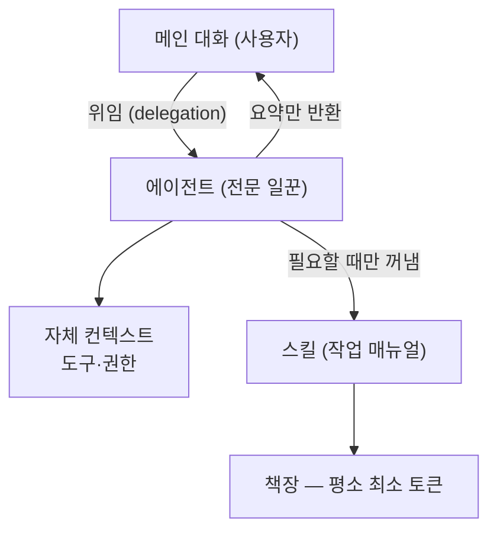
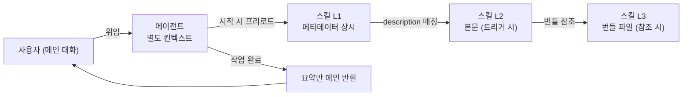
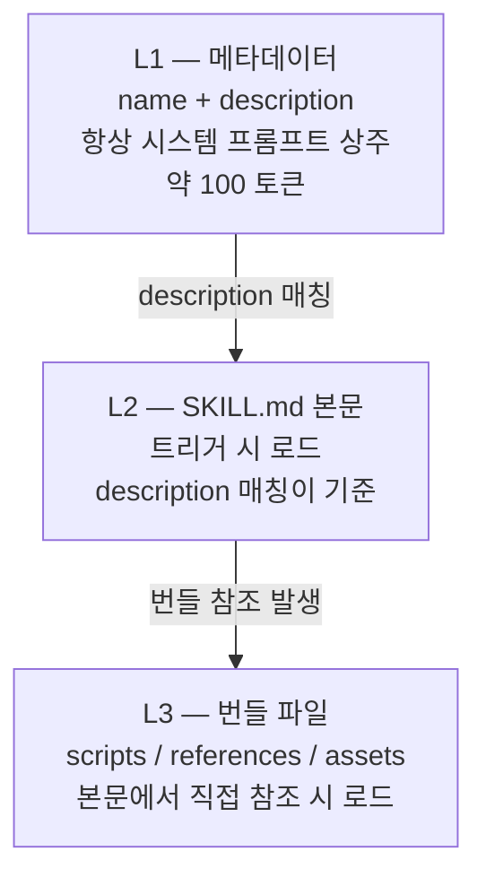
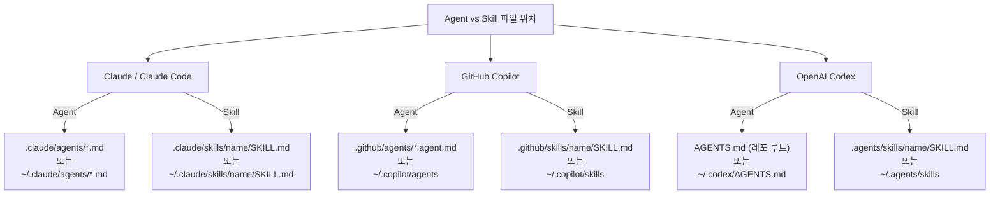

# Agent vs Skill — Claude · Copilot · Codex

> **한 줄 요약**: AI 에이전트(Agent)는 자체 맥락·도구·판단을 갖고 일감을 통째로 맡는 '전문 일꾼'이고, 스킬(Skill)은 그 일꾼이 필요할 때만 펼쳐 읽는 '작업 매뉴얼'이다.

[](index.html)
[](slides/)

---

## 시각 자료 안내

| 자료 | 경로 | 설명 |
|---|---|---|
| 인터랙티브 가이드 | [`index.html`](index.html) | Ferrari 디자인 · 계층형 설명(비유 → 개발자) · 인터랙티브 비교 |
| 발표 슬라이드 | [`slides/`](slides/) | 발표·교육용 자료 |
| 검증 정본 | [`knowledge/verified-facts.md`](knowledge/verified-facts.md) | 6개 타깃 병렬 리서치 + 적대적 교차검증 |
| 종합 분석 | [`knowledge/synthesis.md`](knowledge/synthesis.md) | 비유·8축 비교표·도구 요약 |

---

## 1. 쉬운 비유 — 전문 일꾼 vs 작업 매뉴얼

**에이전트(Agent)** 는 "한 분야 전문가를 따로 채용해 일감 전체를 통째로 맡기는 것"이고,
**스킬(Skill)** 은 "그 전문가가 필요할 때만 책장에서 꺼내 펴 보는 작업 매뉴얼(플레이북)"입니다.

- **에이전트** = 자기만의 작업 책상(별도 컨텍스트)·도구·판단권을 갖고 일을 끝낸 뒤 요약만 가져오는 '사람'
- **스킬** = 그 사람이 일하다 관련 작업을 만났을 때만 펼쳐 읽는 '문서' (평소엔 책장에 꽂혀 자리를 거의 안 차지)



---

## 2. 한 줄 정의

- **에이전트(Agent)** — 자체 컨텍스트·도구·권한·판단을 갖고 위임받은 작업을 수행하는, 재사용 가능한 전문 일꾼(페르소나) 정의.
- **스킬(Skill)** — 특정 작업 수행법을 instructions·스크립트·리소스로 묶은 `SKILL.md` 폴더로, description이 요청과 맞을 때만 본문이 로드되는 재사용 '작업 플레이북'.

---

## 3. 8축 비교표

| 축 | 에이전트 (Agent) | 스킬 (Skill) |
|---|---|---|
| **정의** | 별도 컨텍스트·시스템 프롬프트·도구·권한을 가진 전문 일꾼 정의. 곁가지 작업을 위임받아 처리하고 요약만 반환 | 작업 수행법(instructions)+선택적 스크립트·참조파일을 묶은 SKILL.md 폴더. 일반 에이전트를 특정 작업 전문가로 임시 변신 |
| **핵심 목적** | 역할/페르소나 분리 — 별도 맥락에서 한 책무를 독립 수행, 메인 대화 비오염 | 능력/지식 주입 — 컨텍스트를 부풀리지 않고 필요할 때만 전문 절차 로드 |
| **자율성/판단** | 높음 — 자체 도구·권한으로 스스로 판단, 일감 전체를 끝까지 수행 | 낮음 — 호출 주체의 판단 안에서 절차·지식 제공. 스스로 일꾼을 부리지 않음 |
| **호출 방식** | 자동(description 매칭 위임) + 명시(이름 지목·@mention·세션 채택). Copilot은 명시/선택 중심 | 자동(description 매칭 로드) + 명시(`/skill명` 또는 `$skill명`). description이 트리거 핵심 |
| **재사용 단위** | 한 개 Markdown(+YAML) 정의 파일 = 하나의 일꾼/페르소나 | SKILL.md 1개 + 번들 리소스 폴더 = 하나의 작업 패키지 |
| **컨텍스트 비용** | 별도 컨텍스트 윈도우 새로 소비. 결과는 요약만 메인에 합류 | 점진적 공개 — 메타데이터만 상시, 본문은 트리거 시, 번들은 참조 시 로드(평소 최소) |
| **대표 파일/위치** | Claude `.claude/agents/*.md` / Copilot `.github/agents/*.agent.md` / Codex `AGENTS.md` | 공통 `SKILL.md` — Claude `.claude/skills/<n>/` / Copilot `.github/skills/<n>/` / Codex `.agents/skills/<n>/` |
| **대표 예시** | Claude code-reviewer 서브에이전트, Copilot test-specialist, Codex AGENTS.md | pdf-processing 스킬, github-actions-failure-debugging, Codex code-reviewer SKILL |

---

## 4. 도구별 설명

### 4-1. Claude / Claude Code (Anthropic)

#### Agent — Subagent (서브에이전트)

자체 컨텍스트 윈도우·시스템 프롬프트·도구 접근·권한을 가진 전문 보조 AI. 곁가지 작업을 위임받아 처리하고 **요약만** 메인 대화에 반환한다.

- **위치(우선순위 높음→낮음)**: 관리/조직 설정 → `--agents` CLI(세션) → 프로젝트 `.claude/agents/` → 사용자 `~/.claude/agents/` → 플러그인 `agents/`
- **주요 필드**: `name`(필수), `description`(필수·위임 트리거), `tools`, `model`, `skills`(시작 시 프리로드), `permissionMode`, `maxTurns`
- **호출**: 자동(description 매칭) + 명시(자연어 지목·`@agent-<name>`) + 세션 전체(`claude --agent <name>`)

```markdown
---
name: code-reviewer
description: Expert code review specialist. Proactively reviews code for quality, security, and maintainability. Use immediately after writing or modifying code.
tools: Read, Grep, Glob, Bash
model: inherit
---

You are a senior code reviewer ensuring high standards of code quality and security.

When invoked:
1. Run git diff to see recent changes
2. Focus on modified files
3. Begin review immediately

Provide feedback organized by priority:
- Critical issues (must fix)
- Warnings (should fix)
- Suggestions (consider improving)
```

> 출처: https://code.claude.com/docs/en/sub-agents [SOURCE]

#### Skill — Agent Skill

`SKILL.md`(+선택 스크립트·참조파일)를 담은 폴더. 오픈 표준(agentskills.io)으로 Claude Code·Claude API·claude.ai 공통. description이 요청과 맞을 때 **온디맨드 로드**하여 범용 에이전트를 임시 전문가로 변신시킨다.

- **위치**: 개인 `~/.claude/skills/<name>/SKILL.md`, 프로젝트 `.claude/skills/<name>/SKILL.md`. 충돌 우선순위: enterprise > personal > project
- **주요 필드**: `name`, `description`(발견의 핵심), `when_to_use`, `allowed-tools`, `context`
- **호출**: 자동(description 매칭) + 명시(`/skill-name`)

```markdown
---
name: pdf-processing
description: Extract text and tables from PDF files, fill forms, merge documents. Use when working with PDF files or when the user mentions PDFs, forms, or document extraction.
---

# PDF Processing

## Quick start
Use pdfplumber to extract text from PDFs:

```python
import pdfplumber
with pdfplumber.open("document.pdf") as pdf:
    text = pdf.pages[0].extract_text()
```

For advanced form filling, see FORMS.md.
```

> 출처: https://platform.claude.com/docs/en/agents-and-tools/agent-skills/overview · https://code.claude.com/docs/en/skills [SOURCE]

---

### 4-2. GitHub Copilot

> **주의 — "agent" 과부하 용어**: Copilot에서 "agent"는 여러 의미로 쓰인다. 본 가이드의 "재사용 에이전트 정의" = **Custom agents(.agent.md)**. 그 외 Copilot coding agent(이슈→PR 자동화), Extension type=agent(GitHub App 통합), VS Code agent mode(대화형 UI)는 별개 개념이다.

#### Agent — Custom agents

특정 역할/워크플로우에 맞춰 Copilot을 특화하는 재사용 파일 정의.

- **포맷**: Markdown + YAML frontmatter. 확장자 `.agent.md`(`.md`도 허용). 본문 최대 30,000자
- **위치**: `.github/agents/<name>.agent.md`. org/enterprise는 `.github`의 `agents/`, CLI는 `~/.copilot/agents`
- **호출**: 명시/사용자 선택 중심(github.com 작업 배정 시 선택 / CLI 선택 / VS Code 드롭다운)

```markdown
---
name: test-specialist
description: Focuses on test coverage, quality, and testing best practices without modifying production code
---

You are a testing specialist focused on improving code quality through comprehensive testing. Your responsibilities:

- Analyze existing tests and identify coverage gaps
- Write unit tests, integration tests, and end-to-end tests following best practices
- Review test quality and suggest improvements for maintainability
- Focus only on test files and avoid modifying production code unless requested
```

> 출처: https://docs.github.com/en/copilot/concepts/agents/cloud-agent/about-custom-agents [SOURCE]

#### Skill — Agent Skills vs Skillset (구분 필수)

Copilot에서 "skill"은 두 가지를 가리킨다. 혼동 금지.

**(1) Agent Skills (`SKILL.md`)** — Claude/Codex와 같은 오픈 표준의 직접 대응물

- **위치**: `.github/skills/<name>/SKILL.md`. 개인 `~/.copilot/skills/`
- **필드**: `name`(필수), `description`(필수), `license`, `allowed-tools`

```markdown
---
name: github-actions-failure-debugging
description: Guide for debugging failing GitHub Actions workflows. Use this when asked to investigate why a workflow run failed.
license: MIT
---

# Debugging GitHub Actions failures

When a workflow run fails:
1. Identify the failing job and step from the run logs.
2. Re-read the step's `run:` command and its env.
3. Check for missing secrets, permissions, or cache misses.
4. Propose a minimal fix and explain it.
```

**(2) Skillset (Copilot Extensions)** — `SKILL.md` 파일이 아님

GitHub App에 정의하는 최대 5개 API 엔드포인트 모음. Copilot이 쿼리를 라우팅해 엔드포인트를 호출한다. `SKILL.md`로 만드는 Agent Skills와 **완전히 별개**이므로 혼동하지 말 것.

> 출처: https://github.blog/changelog/2025-12-18-github-copilot-now-supports-agent-skills/ · https://docs.github.com/en/copilot/concepts/build-copilot-extensions/skillsets-for-copilot-extensions [SOURCE]

---

### 4-3. OpenAI Codex

#### Agent — AGENTS.md

레포(또는 Codex 홈)에 두는 **순수 Markdown** 지침 파일. 빌드·테스트 명령·코드 스타일·관례·가드레일 등 프로젝트 컨텍스트를 제공한다.

> **중요 교정**: AGENTS.md는 명명·파라미터화된 '페르소나 매니페스트'가 아니다. 여러 에이전트(Codex·Cursor·Copilot·Jules 등)가 공유하는 프로젝트 지침("README for agents"). "에이전트=페르소나"로 본다면 가장 가까운 대응물이지만, Codex의 별도 커스텀 에이전트 기능과 동일하지 않다.

- **포맷**: 순수 Markdown(스키마·YAML frontmatter 없음)
- **위치**: 레포 루트 + 전역 `~/.codex/AGENTS.md`(`$CODEX_HOME` 기본값)
- **호출**: 자동·실행당 1회(세션 시작 시 읽음)

```markdown
# AGENTS.md

## Setup commands
- Install deps: `pnpm install`
- Start dev server: `pnpm dev`
- Run tests: `pnpm test`

## Code style
- TypeScript strict mode
- Single quotes, no semicolons
- Use functional patterns where possible
```

> 출처: https://agents.md/ · https://developers.openai.com/codex/guides/agents-md [SOURCE]

#### Skill — Agent Skills (SKILL.md)

> **교정**: SKILL.md 오픈 표준은 **Anthropic이 2025-12-18 공개·오픈소스화**하고 Codex가 채택한 것이다(OpenAI 원작 아님). 선행 기능 Custom Prompts는 deprecated.

- **위치(현행)**: `.agents/skills`(레포 현재/부모/루트), `~/.agents/skills`, `/etc/codex/skills` + 빌트인
- **호출**: 자동(name+description 프리로드 후 매칭) + 명시(`/skills` 또는 `$skill명`)

```
---
name: code-reviewer
description: Reviews code for bugs, security issues, and style violations. Use when the user asks to review code, check a PR, or find issues.
---
Skill instructions for Codex to follow.

(폴더 레이아웃)
my-skill/
├── SKILL.md      (필수)
├── scripts/      (선택)
├── references/   (선택)
├── assets/       (선택)
└── agents/openai.yaml  (선택 — Codex 전용 메타데이터)
```

> 출처: https://developers.openai.com/codex/skills [SOURCE]

---

## 5. 함께 쓰기 — 보완 관계

에이전트가 '일꾼'이라면 스킬은 그 일꾼이 펼쳐 보는 '매뉴얼'. 두 개념은 대체제가 아니라 **보완재**다.

- **Claude 서브에이전트** → frontmatter의 `skills` 필드로 시작 시 특정 스킬을 프리로드
- **Claude 스킬** → `context: fork`로 격리된 서브에이전트 안에서 실행 가능

→ 전문 페르소나(에이전트)에 재사용 작업 능력(스킬)을 얹는 방식으로 함께 동작한다.



---

## 6. 스킬 점진적 공개 (Progressive Disclosure)

스킬은 한꺼번에 전부 로드하지 않는다. 세 단계로 나눠 필요할 때만 로드해 컨텍스트 비용을 최소화한다.



---

## 7. 언제 무엇을 쓰나

| 상황 | 선택 | 이유 |
|---|---|---|
| 반복되는 한 가지 역할(코드 리뷰어·보안 감사자)을 메인 대화와 분리해 끝까지 맡길 때 | **Agent** | 별도 컨텍스트·자체 도구·판단 분리 |
| 작업이 길거나 메인 컨텍스트를 오염시키면 안 될 때 | **Agent** | 요약만 반환, 컨텍스트 격리 |
| 권한·도구를 격리하고 싶을 때, 멀티에이전트 오케스트레이션 | **Agent** | `tools`·`permissionMode` 제한 |
| 특정 작업 절차·도메인 지식(PDF 추출·CI 디버깅)을 여러 곳에서 재사용하되 평소엔 컨텍스트를 안 차지하게 하고 싶을 때 | **Skill** | 점진적 공개, 평소 최소 토큰 |
| 새 페르소나가 아니라 기존 어시스턴트/에이전트에 "이 작업은 이렇게 해라"를 주입할 때 | **Skill** | 스킬 = 지식 주입 레이어 |
| 스크립트·템플릿·참조문서를 번들로 배포하고 싶을 때 | **Skill** | L3 번들 파일 지원 |
| 전문 페르소나 + 재사용 작업 능력 둘 다 필요 | **Agent + Skill** | `skills` 프리로드로 조합 |

---

## 8. 도구별 파일 위치 맵



---

## 9. 출처 (공식 문서)

| 도구 | Agent 문서 | Skill 문서 |
|---|---|---|
| **Claude** | [Subagents — Claude Code Docs](https://code.claude.com/docs/en/sub-agents) | [Agent Skills Overview](https://platform.claude.com/docs/en/agents-and-tools/agent-skills/overview) · [Skills — Claude Code](https://code.claude.com/docs/en/skills) · [Skills Blog](https://claude.com/blog/skills) |
| **Copilot** | [Custom agents](https://docs.github.com/en/copilot/concepts/agents/cloud-agent/about-custom-agents) · [Changelog 2025-10-28](https://github.blog/changelog/2025-10-28-custom-agents-for-github-copilot/) | [Agent Skills Changelog](https://github.blog/changelog/2025-12-18-github-copilot-now-supports-agent-skills/) · [Skillsets](https://docs.github.com/en/copilot/concepts/build-copilot-extensions/skillsets-for-copilot-extensions) |
| **Codex** | [AGENTS.md Spec](https://agents.md/) · [Codex Guide](https://developers.openai.com/codex/guides/agents-md) | [Codex Skills](https://developers.openai.com/codex/skills) |
| **오픈 표준** | — | [agentskills.io](https://agentskills.io) (Anthropic 공개 2025-12-18, Codex·Copilot 채택) |

---

## 10. 주의 사항 (버전 의존 항목)

> 아래 항목은 버전·출시 시점에 따라 달라질 수 있어 본문에서 단정을 피하고 각주로만 처리합니다.

[^1]: **Claude 서브에이전트 버전 게이팅** — `Task`→`Agent` 개명(v2.1.63), 포크(v2.1.117+), MCP 제한(v2.1.153), 중첩(v2.1.172) 등 버전 의존. 설치 버전 확인 필요. [NEED-CONFIRM]

[^2]: **Claude 스킬 토큰 수치** — L1 약 100 토큰, L2 5k 미만 등은 2차 출처 기반. 공식 런타임 실측값이 아님. [NEED-CONFIRM]

[^3]: **Copilot Agent Skills GA 시점** — 변경로그상 2026-01초 예고. org/enterprise 가용 여부는 "coming soon" 상태. [NEED-CONFIRM]

[^4]: **Copilot Skillset 문서 URL** — 404 갱신 이력 있음. 위 링크가 만료되면 공식 GitHub Docs에서 재확인 필요. [NEED-CONFIRM]

[^5]: **Codex AGENTS.md `project_doc_max_bytes` 기본값** — 32 KiB로 인용되나 버전 변동 가능. [NEED-CONFIRM]

[^6]: **SKILL.md 오픈 표준 거버넌스** — agentskills.io의 Agentic AI Foundation / Linux Foundation 이전 여부 미확정. [NEED-CONFIRM]

---

> 사실 정본: [`knowledge/verified-facts.md`](knowledge/verified-facts.md) — 6개 타깃 병렬 리서치 + 적대적 교차검증(2026-06-15). 이 README의 모든 수치·파일 경로·필드명은 해당 파일에서 직접 인용.
