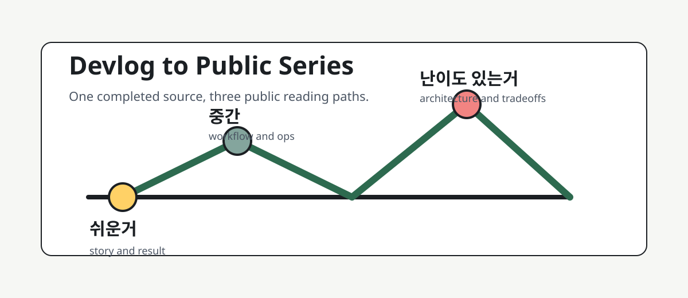

# Issue 001: Custom AI Companion Workflow

This topic rewrites a completed internal devlog into public-safe articles about building a custom AI companion as a packaged workflow.

## Reading Paths

| Level | Article | Purpose |
| --- | --- | --- |
| 쉬운거 | [`easy.ko.md`](easy.ko.md) | Explain the story and outcome without assuming technical background |
| 중간 | [`middle.ko.md`](middle.ko.md) | Explain the operating workflow for Korean IT practitioners |
| 난이도 있는거 | [`advanced.ko.md`](advanced.ko.md) | Explain the architecture, verification contract, and runtime lessons |

## Source

Public source ID: `devlog-2026-05-09-custom-ai-companion`

The private source included local paths, package evidence, generated images, and validation notes. This public version keeps the workflow lesson and removes private environment details.

## Release Checklist

- [x] Source case is complete.
- [x] Public-safe rewrite exists.
- [x] Three reading levels exist.
- [x] Binary image assets are not committed.
- [x] External publishing should start as draft or preview.
